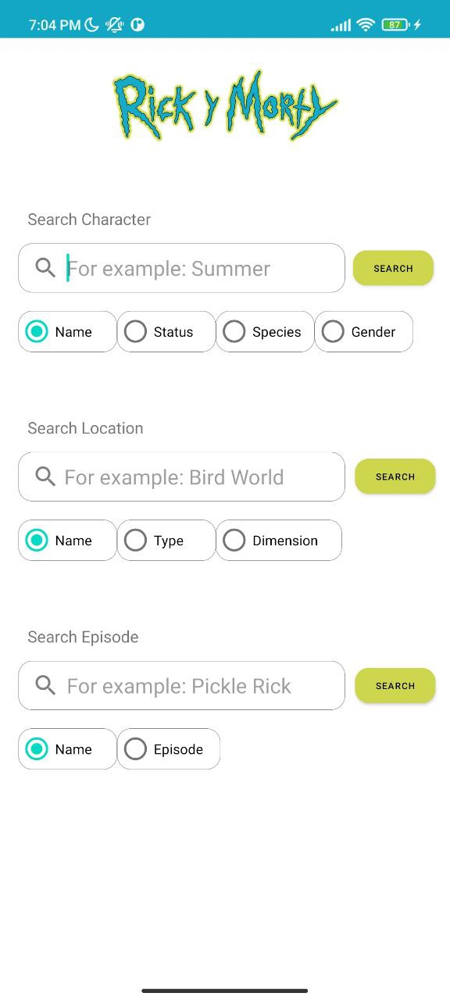
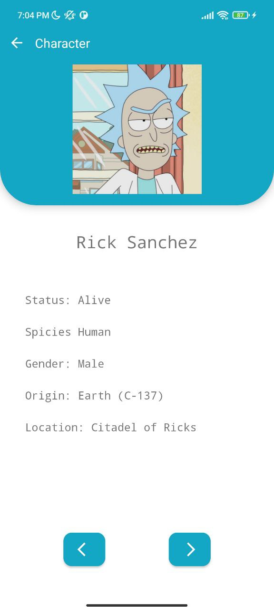
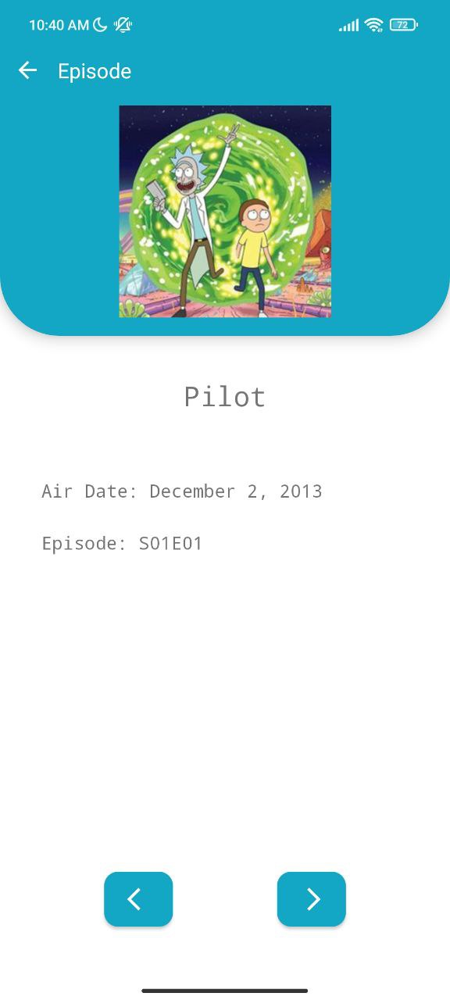

# RickAndMortySearchTool

Android app to search characters, locations and episodes from the tv show "Rick and Morty" applying different kind of filters.

    

**This project implement:**

- Flow
- Hilt (dependency injection) 
- Retrofit
- Coroutines
- Live Data
- MVVM
- Constraint layout
- View Binding
- Navigation Components

# Screenshots

  
